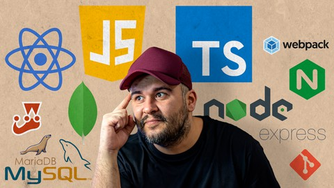

<div align="center" id="top">
  

&#xa0;

  <!-- <a href="https://cursojs.netlify.app">Demo</a> -->
</div>

<h1 align="center">JavaScript Course</h1>

<p align="center">
  

  

  

  

  <!--  -->

  <!--  -->

  <!--  -->
</p>

<!-- Status -->

<!-- <h4 align="center">
	🚧  Curso Js 🚀 Under construction...  🚧
</h4>

<hr> -->

<p align="center">
  <a href="#dart-about">About</a> &#xa0; | &#xa0;
  <!-- <a href="#sparkles-features">Features</a> &#xa0; | &#xa0; -->
  <a href="#rocket-technologies">Technologies</a> &#xa0; | &#xa0;
  <a href="#white_check_mark-requirements">Requirements</a> &#xa0; | &#xa0;
  <a href="#checkered_flag-starting">Starting</a> &#xa0; | &#xa0;
  <a href="#memo-license">License</a> &#xa0; | &#xa0;
  <a href="https://github.com/AlexMarquesAlves" target="_blank">Author</a>
</p>

<br>

## :dart: About

Este é o repositório onde apliquei os exemplos que são usados no curso de
[Javascript do básico ao avançado](https://www.udemy.com/course/curso-de-javascript-moderno-do-basico-ao-avancado/)

### Sinta-se à vontade & Bons estudos.

## :rocket: Technologies

The following tools were used in this project:

- [Express](https://expressjs.com/pt-br/)
- [JavaScript](https://developer.mozilla.org/pt-BR/docs/Web/JavaScript)
- [MySQL](https://dev.mysql.com/doc/)
- [NestJS](https://docs.nestjs.com/)
- [Node.js](https://nodejs.org/en/)
- [React](https://pt-br.reactjs.org/)
- [TypeScript](https://www.typescriptlang.org/)
- [Webpack e Babel](https://webpack.js.org/)

## :white_check_mark: Requirements

Before starting :checkered_flag:, you need to have [Git](https://git-scm.com) and [Node](https://nodejs.org/en/) installed.

## :checkered_flag: Starting

```bash
# Clone this project
$ git clone https://github.com/AlexMarquesAlves/JavaScript_Course

# Access
$ cd JavaScript_Course

# Install dependencies
$ yarn

# Run the project
$ yarn start

# The server will initialize in the <http://localhost:3000>
```

## :memo: License

This project is under license from MIT. For more details, see the [LICENSE](LICENSE.md) file.

Made with :heart: by <a href="https://github.com/AlexMarquesAlves" target="_blank">¡Duque</a>

&#xa0;

<a href="#top">Back to top</a>
